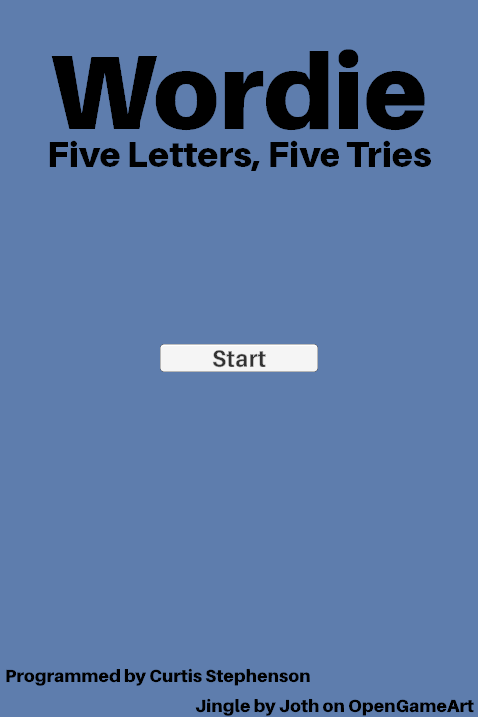
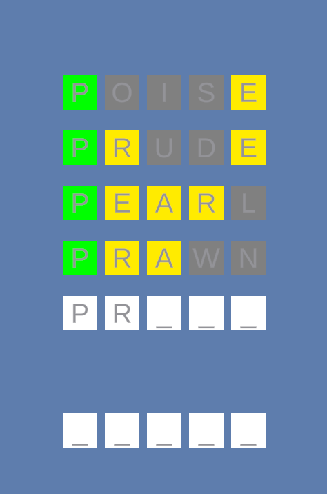
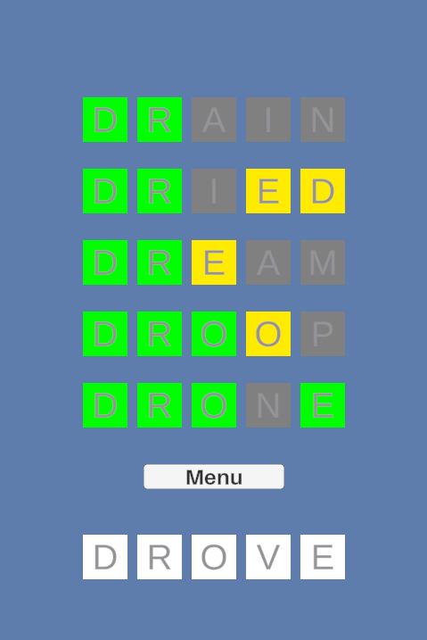

# Wordie - Work in Progress
 A word guessing game built in Unity inspired by games such as 'Wordle' and 'Lingo', where the user must guess a five letter word from a pre-defined list within five attempts.

